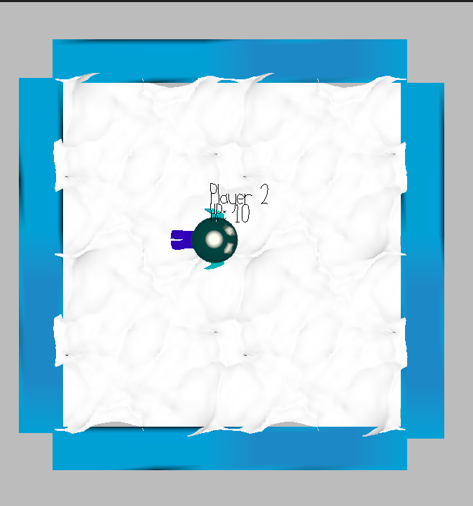

# Bouncing seal

Author: Alex Ding

Design: I would like to see player control two seal to bounce each other inside of area

Networking: 

the client only sends control inputs (left, right, up, down, dash) to the server using a fixed-size C2S_Controls message, and the server is authoritative—it simulates movement, collisions, and HP changes, then broadcasts the entire game state back to clients in an S2C_State message containing each player’s position, velocity, color, name, and HP. On the client side, PlayMode::update sends controls every frame and calls game.recv_state_message to process incoming state updates.

Screen Shot:

How To Play:

Press AD to rotate, and Press Space to dash, try to push other to the wall

Sources: 

Sea: https://www.youtube.com/watch?v=3H5F0fhB184
Code reference: https://github.com/flowerflora/MultiplayerGame
Chat GPT help debug 

This game was built with [NEST](NEST.md).

Several BUGs didn't fix:

Can't freeze game when hp<=0
Pressing R didn't reset player location
When hp<0 seal will run out of the map
Hitting logical still need to improve
